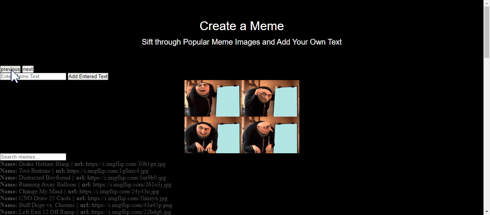
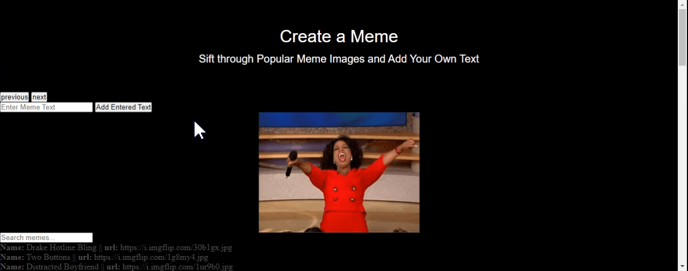
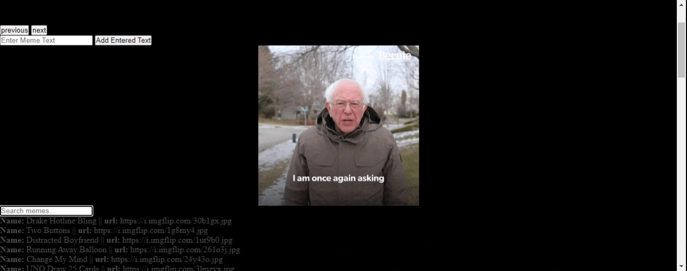

# Meme Creator
The Meme Generator is a single-page app that allows the user to customize their own meme.

## Project Purpose and Features
This app is a Single Page Application that creates a quick way to fetch popular meme images from the imgflip API, customize with their own text, and quickly search for an image URL. 

## How-To Guide
1. Start by navigating forward or backward through the images available in the ImgFlip API using the dedicated Next and Previous buttons. 

2. Add your own text by typing in the dedicated text field and clicking on the "Add Entered Text" button when ready to add.

3. If you are looking for a particular meme and its associated url, you can filter through the API by entering text in the "search memes.." field.

## Blog Reference
I created a blog post with a guide on how to fetch the API data as well as create the next and previous buttons here: https://vanessawagner.github.io/APIs-and-Javascript/

## Sources and Technologies
Imgflip API: https://api.imgflip.com/get_memes

Vanilla JavaScript

JSON server
